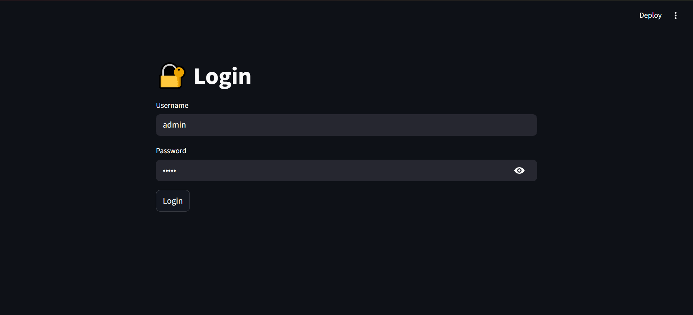
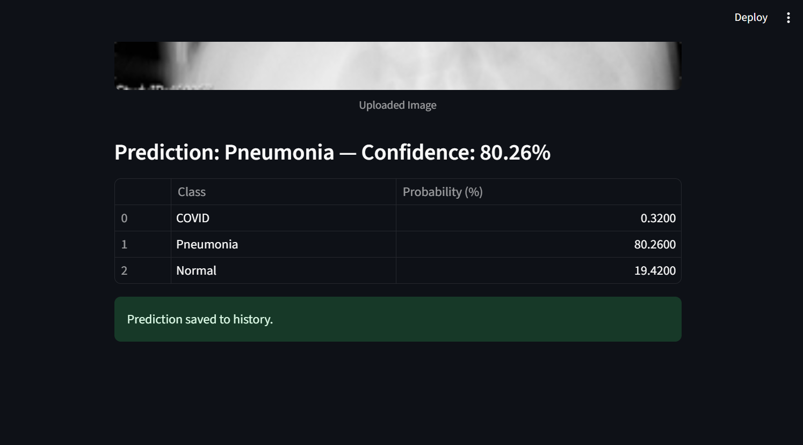
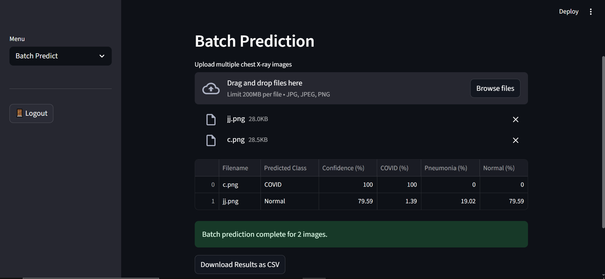
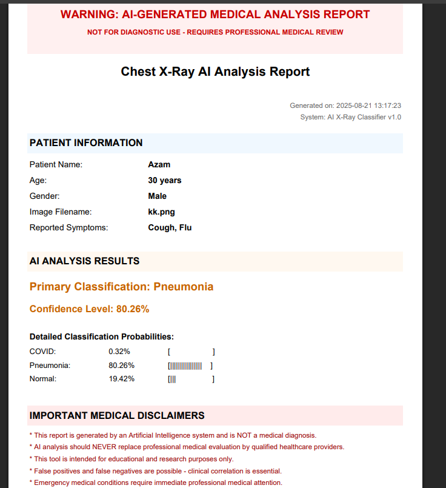

# Chest X-Ray Classifier (COVID / Pneumonia / Normal)

This project is a **Streamlit-based web application** that classifies chest X-rays into **COVID**, **Pneumonia**, or **Normal** using a trained **CNN model**.  
It also allows generating patient-specific **PDF reports** (with disclaimers) and maintaining a prediction history.  

**Disclaimer:** This tool is for **research and educational purposes only**. It is **NOT** a substitute for professional medical diagnosis.


## Features
- **Login System** (hardcoded demo accounts: `admin` / `12345`, `doctor` / `med2025`)
- **Single & Batch Prediction** of X-rays
- **Prediction History** with patient info
- **Generate PDF Reports** for each case
- **Model Information Section** (architecture, notes, dataset info)


## Project Structure

├── app.py # Main Streamlit app  

├── cnn_scratch_train.keras # Trained CNN model  

├── dataset_info.txt # Dataset source & ownership info  

├── prediction_history.json # Stores past predictions (sample file)  

├── README.md # Project documentation  

├── requirements.txt # Python dependencies  


## Installation

1. Clone this repository:

```bash
git clone https://github.com/abdullah-umar-22/xray-classifier.git
cd xray-classifier

```

2. Install Dependencies

```bash
pip install -r requirements.txt

```

## Usage

Run app with:

```bash
streamlit run app.py

```

The app will open in your browser 
Login with demo credentials:

-Username: admin | Password: 12345
-Username: doctor | Password: med2025


## Demo Screenshots

### Login Page


### Single Prediction


### Batch Prediction


### PDF Report


## Model Details

**Type**: Custom CNN trained from scratch  

**Input Size**: 128 × 128 × 3  

**Classes**: COVID, Pneumonia, Normal  

**Framework**: TensorFlow / Keras  

**Trained Model File**: cnn_scratch_train.keras  

## Dataset

The dataset is not included in this repo due to size restrictions.
Please refer to dataset_info.txt for details and dataset ownership.
The model is trained using Lung Segmentation Data images only and not masks.

## Example Output

-Single Prediction: Displays predicted class + confidence + probabilities table.  

-Batch Prediction: Process multiple X-rays and export results as CSV.  

-History Section: Saves patient info + predictions for later review.  

-PDF Report Generation: Patient-specific analysis report with disclaimers.


## Acknowledgements

TensorFlow / Keras team  

Streamlit team  

Original dataset authors (see dataset_info.txt)